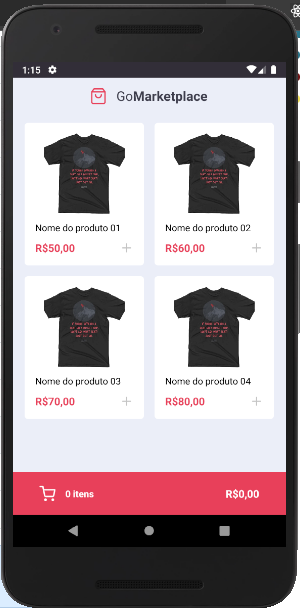
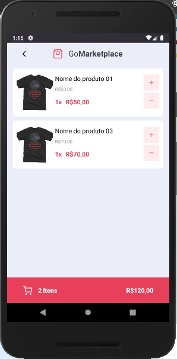

## GoMarketplace

O GoMarketplace e mais um dos desafios desenvolvidos durante o GoStack <strong>Rocketseat</strong>. Dessa vez o desafio foi desenvolver um mini marketplace em <strong>React Native</strong>.

Para concluir o desafio foi preciso utilizar vários conhecimentos adquiridos durante as aulas, como:

- Api Context
- Async Storage
- Axios
- Hooks

caso tenha interesse em rodar o  projeto localmente, baixe o código para a máquina e depois execute os seguintes passos:

1 º Passo: execute o comando `yarn` ou `npm install` no terminal para recuperar as dependências do projeto

2º Passo: startar a API fake que foi utilizada durante o desenvolvimento para servi os produtos. Para isso execute o seguinte comando.

`yarn json-server server.json -p 3333`

3º Passo: Caso esteja executando no android, abra o emulador ou conecte o dispositivo físico e execute `yarn android` para buildar e executar a aplicação.

abaixo a aplicação após se executada no emulador ou dispositivo físico.

### Listagem de Produtos

### Produtos no carrinho

